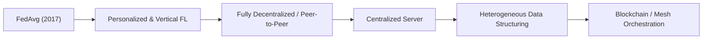

# 🚀 Awesome-Federated-Learning 🌟

  
   
  
  

## 🧠 Federated Learning (FL): Evolution, Variants, Types, & Applications

Welcome to the most comprehensive and **SEO-optimized** repository for **Federated Learning (FL)** resources, variants, and applications! 📚✨

Federated Learning is a decentralized machine learning paradigm that enables multiple client devices (e.g., mobile phones, hospitals, IoT devices) to collaboratively train a shared model without ever centralizing their raw data. Instead of moving private data to a central cloud server, the model weights or gradients are sent to the devices, updated locally, and aggregated centrally, preserving data privacy by design.

---

## ⏳ 1. The Chronological Evolution

The progression of Federated Learning reflects a transition from simple cloud-coordinated heuristic aggregation to highly adaptive, decentralized, and security-hardened ecosystems.

| Era | Concept | Year First Used | Paper Link |
| :--- | :--- | :--- | :--- |
| [**The Foundation Era (FedAvg)**](pages/FedAvg.md) | Introduced by Google. Synchronous rounds of local Stochastic Gradient Descent (SGD) on client devices, followed by an unweighted or weighted averaging of model updates on a central coordinator server. | 2016 | [McMahan et al.](https://arxiv.org/abs/1602.05629) |
| [**The System Heterogeneity Era**](pages/System_Heterogeneity.md) | Developed to handle Non-IID (not identically and independently distributed) data distributions and varying client hardware speeds, introducing tracking algorithms like FedProx and Scaffold to prevent model divergence. | 2018 | [Li et al.](https://arxiv.org/abs/1812.06127) |
| [**The Fully Decentralized & Trustless Era**](pages/Fully_Decentralized.md) | Eliminates the central coordinator server entirely. Clients communicate over a peer-to-peer mesh network, often utilizing blockchain ledgers or smart contracts to manage trust, consensus, and model aggregation. | 2018 | [Lalitha et al.](https://arxiv.org/abs/1802.08722) |

---

## 🏗️ 2. Structural & Data Partitioning Variants

These variants define how data is distributed across different nodes in the network based on the overlap of sample spaces and feature spaces.

| Variant | Mechanism & Example | Year First Used | Paper Link |
| :--- | :--- | :--- | :--- |
| [**Horizontal Federated Learning (Sample-Based)**](pages/Horizontal_FL.md) | **Mechanism:** Datasets share the exact same feature space but differ significantly in their sample IDs. **Example:** Two regional banks training a joint fraud detection system. Both banks collect identical metrics (income, transactions) but own completely different, distinct customer bases. | 2019 | [Yang et al.](https://arxiv.org/abs/1902.04885) |
| [**Vertical Federated Learning (Feature-Based)**](pages/Vertical_FL.md) | **Mechanism:** Datasets share overlapping sample IDs but differ in their feature spaces. **Example:** A local bank and an e-commerce company in the same city. They share many of the same customers, but the bank holds financial history while the e-commerce company holds retail buying history. | 2019 | [Yang et al.](https://arxiv.org/abs/1902.04885) |
| [**Federated Transfer Learning (FTL)**](pages/Federated_Transfer_Learning.md) | **Mechanism:** Applied when both the sample IDs and the feature spaces have very little overlap across clients. Uses deep transfer learning to map the distinct feature spaces into a shared, hidden representation layer before executing federated calculations. | 2019 | [Yang et al.](https://arxiv.org/abs/1902.04885) |

---

## 🌐 3. Network Architecture & Scaling Types

These types define the system-level topology and physical distribution of the participating processing units.

| Type | Topology & Constraints | Year First Used | Paper Link |
| :--- | :--- | :--- | :--- |
| [**Cross-Device Federated Learning**](pages/Cross_Device_FL.md) | **Topology:** Scales to millions of highly unstable, resource-constrained mobile or IoT devices. **Constraints:** Communication must be asynchronous, and the system must survive high client dropout rates (churn) since devices frequently lose network connections or power. | 2019 | [Kairouz et al.](https://arxiv.org/abs/1912.04977) |
| [**Cross-Silo Federated Learning**](pages/Cross_Silo_FL.md) | **Topology:** Involves a small, fixed number of highly reliable institutional organizations (e.g., 5 to 20 medical centers or financial institutions). **Constraints:** All clients are almost always online, possess immense computing infrastructure, and require rigorous compliance and audit trails. | 2019 | [Kairouz et al.](https://arxiv.org/abs/1912.04977) |

---

## 🔐 4. Advanced Security & Privacy Adapters

While Federated Learning keeps raw data local, model gradients can still leak private information through reverse-engineering attacks. These variants augment FL with cryptographic boundaries.

| Adapter | Mechanism | Year First Used | Paper Link |
| :--- | :--- | :--- | :--- |
| [**Differential Privacy (DP) Federated Learning**](pages/Differential_Privacy.md) | Adds mathematical Gaussian or Laplacian noise directly to local gradients before sending them to the aggregator. This guarantees that an adversary cannot deduce whether a specific individual's data was used in training. | 2017 | [Geyer et al.](https://arxiv.org/abs/1712.07557) |
| [**Secure Multi-Party Computation (SMPC)**](pages/SMPC.md) | Uses cryptographic secret sharing protocols. The central server can only see the combined, aggregated total of all client updates, keeping individual client weight updates completely unreadable during transit. | 2017 | [Bonawitz et al.](https://eprint.iacr.org/2017/281) |
| [**Trusted Execution Environments (TEE-FL)**](pages/TEE_FL.md) | Directs the aggregation phase to execute inside secure, hardware-isolated memory enclaves (like Intel SGX) on the cloud server, protecting the global model from being compromised by cloud provider insiders. | 2020 | [Mo et al.](https://arxiv.org/abs/2104.14380) |

---

## 🏭 5. Production Real-World Applications

| Application | Description | Year First Used | Paper Link |
| :--- | :--- | :--- | :--- |
| [**Smart Keyboard Next-Word Prediction**](pages/Smart_Keyboard.md) | Modern smartphones collaboratively train autocomplete and text correction models locally on user devices without sending private chats, keys, or text entries back to a corporate cloud. | 2018 | [Hard et al.](https://arxiv.org/abs/1811.03604) |
| [**De-Identified Medical Image Diagnostics**](pages/Medical_Image.md) | Hospitals worldwide train a unified deep neural network to detect rare tumors by aggregating model updates across silos, successfully bypassing strict medical data privacy laws (like HIPAA or GDPR). | 2020 | [Rieke et al.](https://www.nature.com/articles/s41746-020-00323-1) |
| [**Autonomous Fleet Learning**](pages/Autonomous_Fleet.md) | Self-driving vehicle fleets process edge-case driving data locally on their internal hardware boards overnight, uploading compressed structural model adjustments over Wi-Fi to improve global object detection arrays simultaneously. | 2018 | [Samarakoon et al.](https://arxiv.org/abs/1807.08127) |

## ⭐️ Star History

<a href="https://www.star-history.com/?repos=ishandutta2007/Awesome-Federated-Learning&type=date&legend=bottom-right">
<picture>
<source media="(prefers-color-scheme: dark)" srcset="https://api.star-history.com/chart?repos=ishandutta2007/Awesome-Federated-Learning&type=date&theme=dark&legend=bottom-right" />
<source media="(prefers-color-scheme: light)" srcset="https://api.star-history.com/chart?repos=ishandutta2007/Awesome-Federated-Learning&type=date&legend=bottom-right" />

</picture>
</a>

