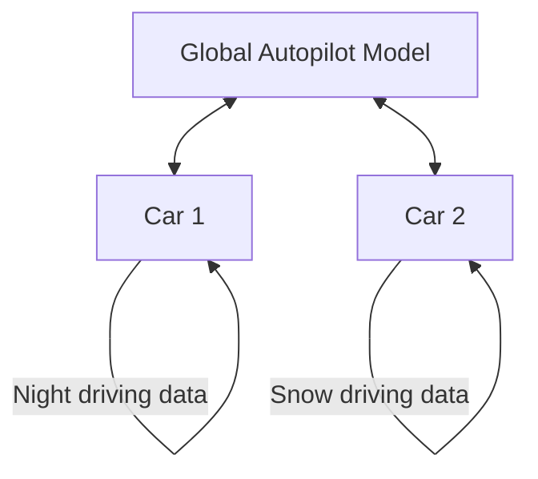

# Autonomous Fleet Learning

## Overview
Self-driving vehicle fleets process edge-case driving data locally.

## Architecture Diagram

```mermaid
graph TD;
    A[Global Autopilot Model] <--> B[Car 1];
    A <--> C[Car 2];
    B -->|Night driving data| B;
    C -->|Snow driving data| C;
```

[Back to README](../README.md)