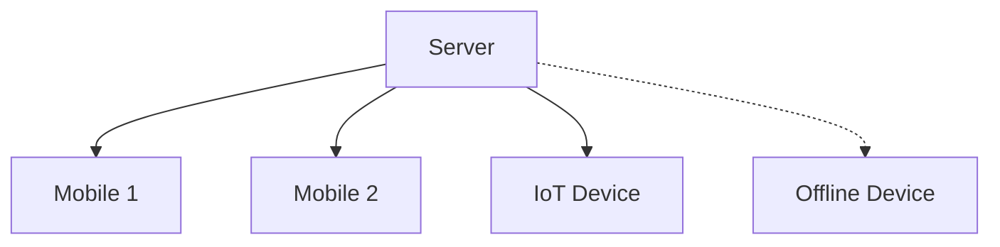

# Cross-Device Federated Learning

## Overview
Scales to millions of highly unstable, resource-constrained mobile or IoT devices.

## Architecture Diagram

```mermaid
graph TD;
    A[Server] --> B[Mobile 1];
    A --> C[Mobile 2];
    A --> D[IoT Device];
    A -.-> E[Offline Device];
```

[Back to README](../README.md)