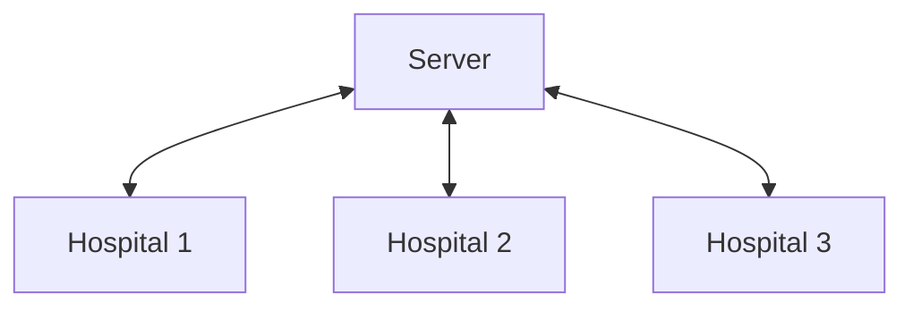

# Cross-Silo Federated Learning

## Overview
Involves a small, fixed number of highly reliable institutional organizations.

## Architecture Diagram

```mermaid
graph TD;
    A[Server] <--> B[Hospital 1];
    A <--> C[Hospital 2];
    A <--> D[Hospital 3];
```

[Back to README](../README.md)