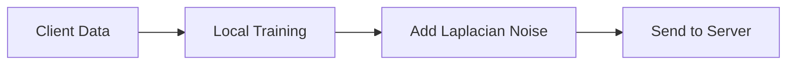

# Differential Privacy (DP) FL

## Overview
Adds mathematical noise directly to local gradients before sending them to the aggregator.

## Architecture Diagram

```mermaid
graph LR;
    A[Client Data] --> B[Local Training];
    B --> C[Add Laplacian Noise];
    C --> D[Send to Server];
```

[Back to README](../README.md)