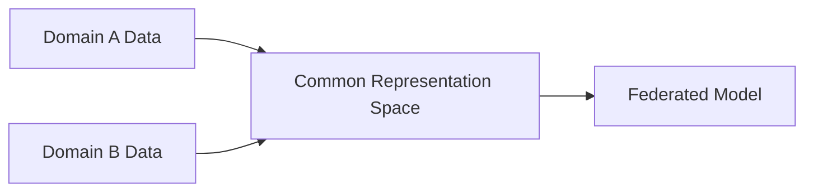

# Federated Transfer Learning (FTL)

## Overview
Applied when both the sample IDs and the feature spaces have very little overlap across clients.

## Architecture Diagram

[Back to README](../README.md)