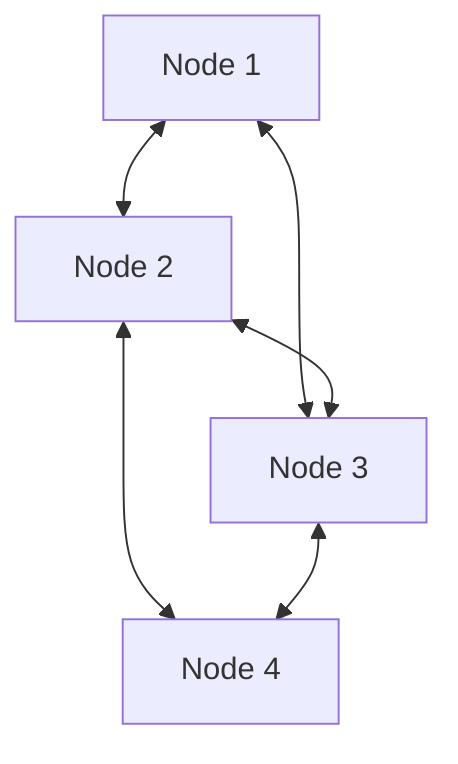

# The Fully Decentralized & Trustless Era

## Overview
Eliminates the central coordinator server entirely. Clients communicate over a peer-to-peer mesh network, often utilizing blockchain ledgers.

## Architecture Diagram

[Back to README](../README.md)