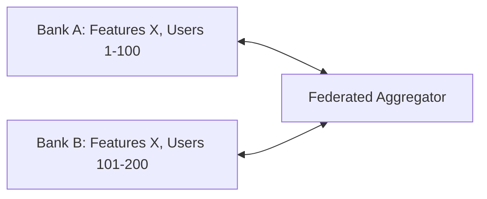

# Horizontal Federated Learning

## Overview
Datasets share the exact same feature space but differ significantly in their sample IDs.

## Architecture Diagram

```mermaid
graph LR;
    A[Bank A: Features X, Users 1-100] <--> C[Federated Aggregator];
    B[Bank B: Features X, Users 101-200] <--> C;
```

[Back to README](../README.md)