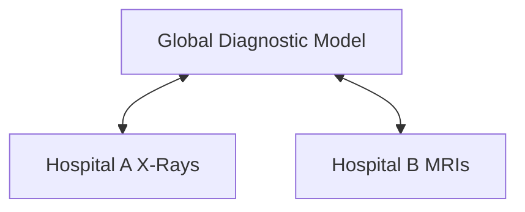

# De-Identified Medical Image Diagnostics

## Overview
Hospitals worldwide train a unified deep neural network to detect rare tumors.

## Architecture Diagram

```mermaid
graph TD;
    A[Global Diagnostic Model] <--> B[Hospital A X-Rays];
    A <--> C[Hospital B MRIs];
```

[Back to README](../README.md)