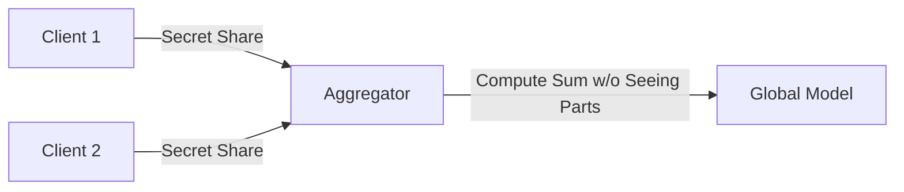

# Secure Multi-Party Computation (SMPC)

## Overview
Uses cryptographic secret sharing protocols to keep individual updates unreadable.

## Architecture Diagram

```mermaid
graph LR;
    A[Client 1] -->|Secret Share| C[Aggregator];
    B[Client 2] -->|Secret Share| C;
    C -->|Compute Sum w/o Seeing Parts| D[Global Model];
```

[Back to README](../README.md)