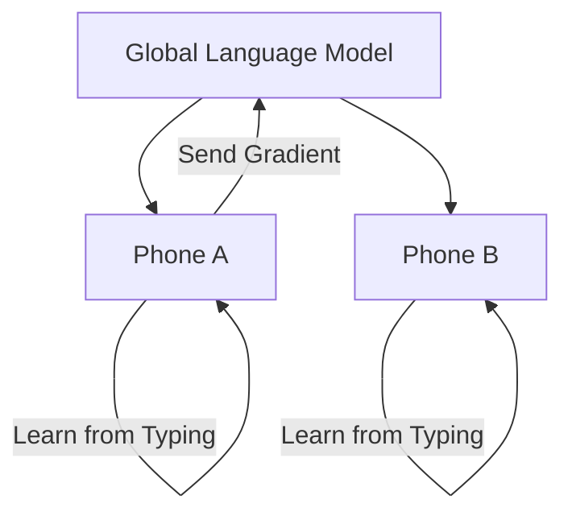

# Smart Keyboard Next-Word Prediction

## Overview
Modern smartphones collaboratively train autocomplete and text correction models locally.

## Architecture Diagram

```mermaid
graph TD;
    A[Global Language Model] --> B[Phone A];
    A --> C[Phone B];
    B -->|Learn from Typing| B;
    C -->|Learn from Typing| C;
    B -->|Send Gradient| A;
```

[Back to README](../README.md)