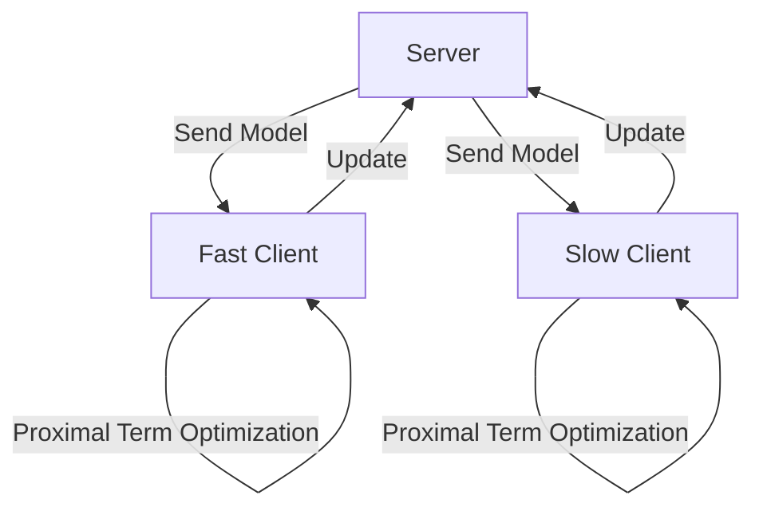

# The System Heterogeneity Era

## Overview
Dealing with Non-IID data distributions and varying client hardware speeds, introducing tracking algorithms like FedProx and Scaffold.

## Architecture Diagram

[Back to README](../README.md)