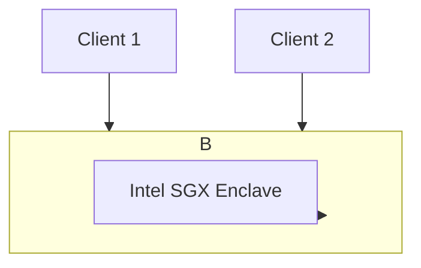

# Trusted Execution Environments (TEE-FL)

## Overview
Directs the aggregation phase to execute inside secure, hardware-isolated memory enclaves.

## Architecture Diagram

[Back to README](../README.md)