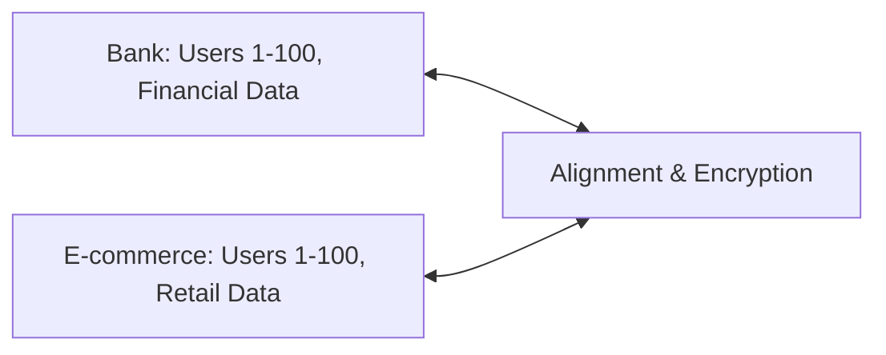

# Vertical Federated Learning

## Overview
Datasets share overlapping sample IDs but differ in their feature spaces.

## Architecture Diagram

```mermaid
graph LR;
    A[Bank: Users 1-100, Financial Data] <--> C[Alignment & Encryption];
    B[E-commerce: Users 1-100, Retail Data] <--> C;
```

[Back to README](../README.md)